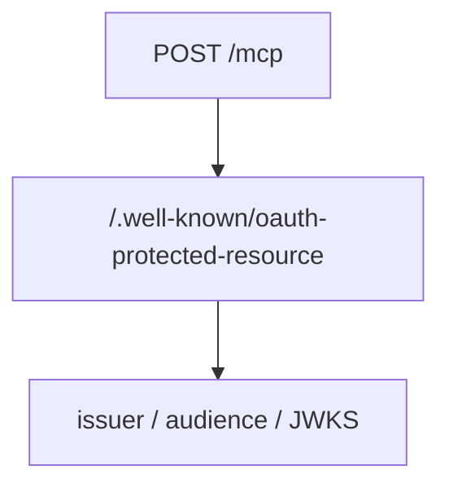

# Mermaid Safe

Use this workflow whenever Mermaid appears in PR descriptions, docs, or inline comments.

## Rule

Prefer quoted node labels whenever the label contains punctuation, paths, URLs, method names, or protocol-ish text.

GitHub Mermaid can fail on unquoted labels containing:

- `/`, such as `/jwks`, `/mcp`, `tools/list`
- `/.well-known/...`
- URLs such as `http://127.0.0.1:3000/mcp`
- `:`, `.`, `?`, `&`, `=`
- parentheses or brackets
- long technical labels with mixed symbols

Use this form:



Avoid unquoted technical labels such as a node label containing an HTTP method plus path, a well-known endpoint, or slash-separated protocol terms.

## Before Publishing

Search for common risky unquoted labels before opening or updating a PR:

```bash
rtk rg -n -- '\\[/|\\[/.well-known|\\[/jwks|\\[/mcp|\\[.*tools/|\\[.*http://' docs AGENTS.md
```

If any match is inside a Mermaid block, quote the label.

## PR Descriptions

When writing PR descriptions with Mermaid:

- Quote every node label that contains paths, URLs, scopes, method names, or protocol terms.
- Prefer short labels and explain details in prose outside the diagram.
- Re-check the body after editing with `gh pr view <number> --json body`.

## Inline Comments

For Mermaid in GitHub review comments, follow the same quoting rule. Inline comments are harder to fix after review threads are created, so be stricter there: quote technical labels even when they might parse unquoted.
