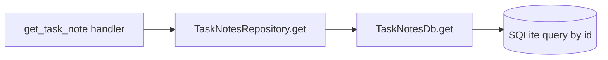
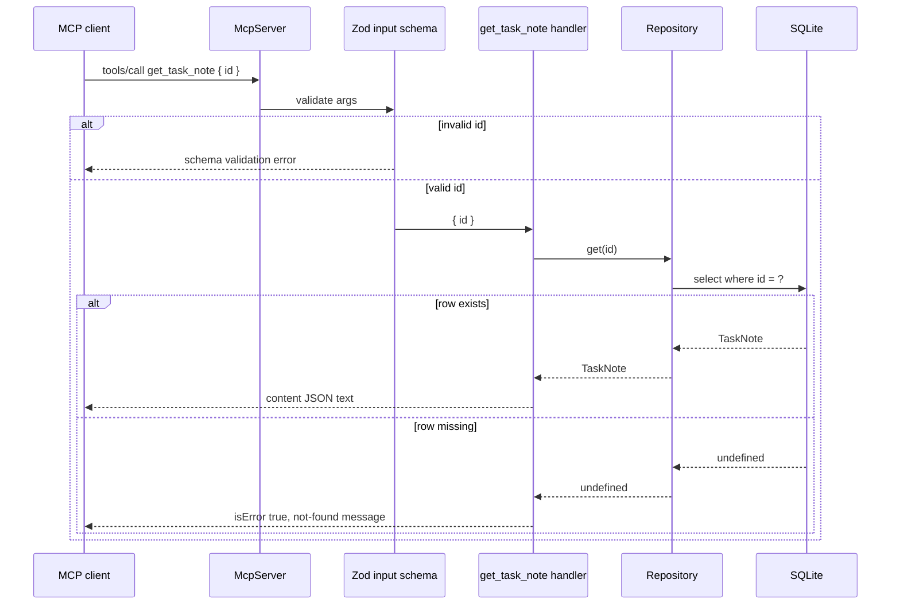

# Step 02: get_task_note で validation と not-found を分ける

## この step の目的

Step 01 では `list_task_notes` だけを作り、MCP tool contract の最小形を確認しました。

Step 02 では `get_task_note` を追加し、次の 2 つを明確に分けます。

- **invalid args**: tool の入力 schema を満たさない。例: `id: -1`
- **not-found**: schema は valid だが、domain data が存在しない。例: `id: 9999`

この違いは production MCP server で重要です。client/agent から見ると、前者は「呼び方が間違っている」、後者は「呼び方は正しいが対象がない」という別の失敗だからです。

## 追加したもの

### Storage / repository

- `TaskNotesDb.get(id)`
- `TaskNotesRepository.get(id)`

SQLite の `where id = ?` は `db.ts` に閉じ込め、MCP tool handler は repository だけを見ます。



### Tool policy

`get_task_note` は read-only tool です。

- `requiredScopes: ["task_notes:read"]`
- `readOnly: true`
- `destructive: false`
- `sideEffect: "none"`

この step ではまだ認可 enforcement はしません。HTTP/JWT step で、この policy を実際の scope check に使います。

### MCP tool

`get_task_note` の input schema:

```ts
z.object({
  id: z.number().int().positive().describe("Task note id"),
})
```

ここで `id` を positive integer にしているため、`id: -1` のような入力は handler に届く前に schema validation error になります。

SDK client から見ると、この lab では `isError: true` の tool result として返りました。重要なのは、error の発生源が handler ではなく input schema であることです。

一方、`id: 9999` は positive integer なので handler に届きます。その後 repository で見つからなければ `isError: true` の MCP result を返します。

## 実行時の流れ



## この step で学ぶこと

MCP tool の failure handling は 1 種類ではありません。

schema validation error は contract violation です。agent/client が tool を誤って呼んでいます。この step では MCP error `-32602` を含む validation result として観察できます。

not-found は domain result です。tool の呼び方は正しいが、対象データがありません。

この区別を早い段階で作っておくと、後続の HTTP status、認可 error、timeout、DB failure も整理しやすくなります。

## テスト

この step では MCP SDK client を使った結合テストを追加します。

unit test ではなく、実際に stdio server を起動して `tools/list` と `tools/call` を叩きます。

```bash
pnpm --filter task-notes-mcp test
```

実際の Codex client から試す手順は `docs/testing.md` にまとめています。
