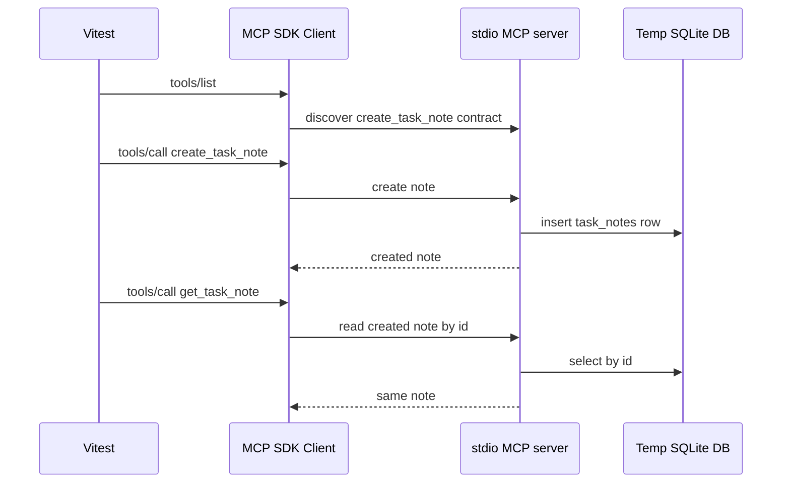

# Step 03: create_task_note を TDD で追加する

## この step の目的

Step 03 では最初の write tool として `create_task_note` を追加します。

学習テーマは **side effect を持つ MCP tool contract** です。

`list_task_notes` と `get_task_note` は read-only でした。`create_task_note` は durable data を作るため、agent/client に次の contract を明示する必要があります。

- `readOnlyHint: false`
- `destructiveHint: false`
- `requiredScopes: ["task_notes:write"]`
- `sideEffect: "create"`

## TDD の進め方

最初に MCP public interface 経由の結合テストを書きました。



RED では次の理由で失敗しました。

- `tools/list` に `create_task_note` が存在しない
- `create_task_note` call が error になる

その後、最小実装で GREEN にしました。

## 追加したもの

### Storage / repository

- `TaskNotesDb.create(input)`
- `TaskNotesRepository.create(input)`

SQLite には `status: "open"` で insert します。

### Tool policy

```ts
create_task_note: {
  requiredScopes: ["task_notes:write"],
  readOnly: false,
  destructive: false,
  sideEffect: "create",
}
```

今の stdio step ではまだ scope enforcement はしません。後続の HTTP/JWT step でこの policy を実際に使います。

### MCP tool

`create_task_note` の input schema:

```ts
z.object({
  title: z.string().min(1).max(120),
  body: z.string().min(1).max(4000),
})
```

## この step で学ぶこと

write tool は「関数としてデータを作れる」だけでは不十分です。

agent/client が事前に判断できるように、tool contract 上で read-only ではないこと、destructive ではないこと、write scope が必要なこと、side effect が create であることを明示します。

## 検証

```bash
pnpm --filter task-notes-mcp test
pnpm build
```

結果:

- Vitest: 1 file / 6 tests passed
- TypeScript build: passed
