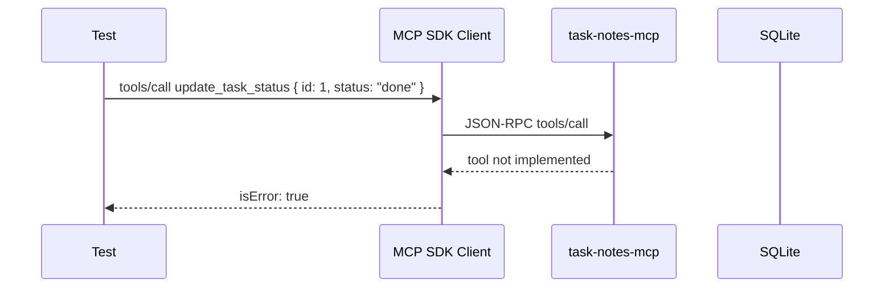
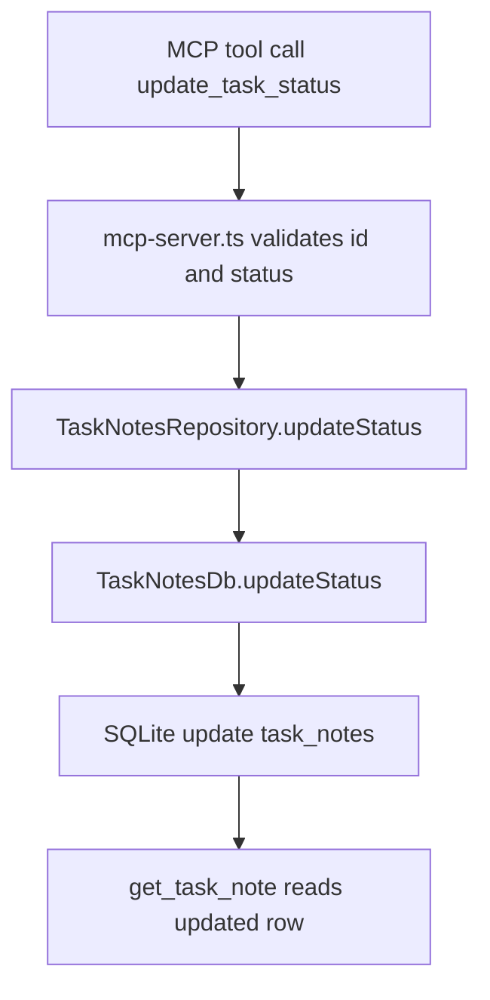

# Step 04: update_task_status を TDD で追加する

Step 04 では、既存 note の `status` を変更する `update_task_status` tool を追加しました。

学習テーマは **update side effect を持つ MCP tool contract** です。

`create_task_note` は新しい durable data を作る tool でした。`update_task_status` は既存 data を変更するため、agent/client に次の contract を明示する必要があります。

- `requiredScopes: ["task_notes:write"]`
- `readOnly: false`
- `destructive: false`
- `sideEffect: "update"`

## RED

最初に、MCP stdio client から `update_task_status` を呼ぶ結合テストを書きました。

RED の失敗は期待どおりでした。

- `rtk pnpm --filter task-notes-mcp test`
- 6 passed / 1 failed
- failure: `expect(updated.isError).not.toBe(true)`

この時点では `update_task_status` tool が未登録なので、MCP client から見ると tool call が error になります。

## GREEN

GREEN では次の 4 層に最小実装を足しました。

### Tool policy

`tool-policy.ts` に `update_task_status` を追加しました。

ここで重要なのは、tool の実装より先に agent-facing contract を明確にすることです。client は tool 名だけでなく、read-only か、destructive か、どんな side effect を持つかを見て approval や routing を判断できます。

### Persistence

`db.ts` では `update task_notes set status = ?, updated_at = ? where id = ?` を実行し、更新後に `get(id)` で読み戻しています。

更新 SQL の戻り値だけでは、client に返す完全な note object がありません。更新後の row を読み戻すことで、MCP tool response と永続化された状態を揃えています。

### Repository

`repository.ts` には `updateStatus(id, status)` だけを公開しました。

MCP handler が SQLite の SQL や table structure を知らない状態を保つためです。

### MCP tool

`mcp-server.ts` では `update_task_status` を登録しました。

input schema は次の 2 つです。

- `id`: positive integer
- `status`: `"open" | "done" | "archived"`

存在しない id は schema error ではなく domain not-found として扱い、既存の `get_task_note` と同じく `isError: true` の tool result を返します。

## GREEN verification

- `rtk pnpm --filter task-notes-mcp test`
  - passed: `Test Files 1 passed (1)`, `Tests 7 passed (7)`
- `rtk pnpm build`
  - passed: `task-notes-mcp`: `tsc -p tsconfig.json`

## Concept

MCP の write tool は「サーバー内部で更新できる」だけでは不十分です。

agent/client が安全に呼び出しを判断できるように、tool contract 上で write scope、read-only ではないこと、side effect の種類を明示する必要があります。

Step 04 では、update tool の observable behavior を MCP public interface からテストし、その contract と永続化の境界を実装しました。
