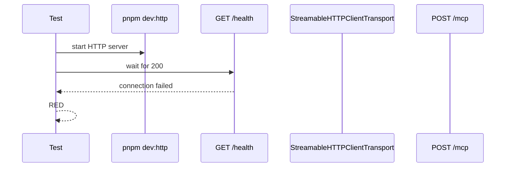
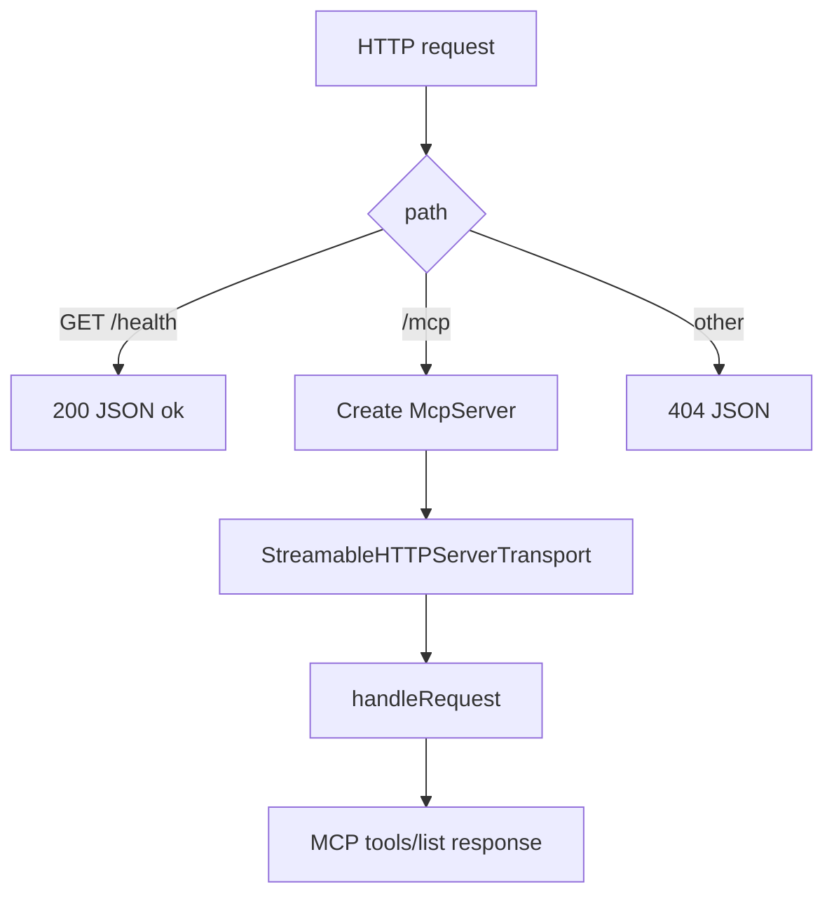

# Step 05: Streamable HTTP transport を追加する

Step 05 では、stdio だけで動いていた MCP server に Streamable HTTP endpoint を追加しました。

学習テーマは **transport を変えても MCP tool contract を保つこと** です。

stdio は local process と MCP client をつなぐには十分ですが、公開 MCP server に近づけるには HTTP endpoint が必要になります。この step ではまだ auth/OAuth/TLS は入れず、HTTP transport だけを独立して確認します。

## RED

最初に、HTTP 経由で `tools/list` ができることを結合テストとして追加しました。

RED の失敗は期待どおりでした。

- `rtk pnpm --filter task-notes-mcp test`
- 7 passed / 1 failed
- failure: `/health` を待ったが接続できず timeout

この時点では `dev:http` script、HTTP entrypoint、`/health`、`/mcp` が未実装でした。

## GREEN

GREEN では次の最小実装を追加しました。

### `dev:http`

`apps/task-notes-mcp/package.json` に `dev:http` を追加しました。

これにより test や手元検証から、stdio とは別の process entrypoint として HTTP server を起動できます。

### `/health`

`/health` は MCP protocol の一部ではありません。

HTTP server が起動しているかを素早く切り分けるための通常 HTTP endpoint です。テストではまず `/health` を待ち、server process の起動失敗と MCP protocol failure を分けています。

### `/mcp`

`/mcp` は SDK の `StreamableHTTPServerTransport` に委譲しています。

この step では `sessionIdGenerator: undefined` を使い、stateless mode にしています。session 管理を入れると HTTP transport と session lifecycle の学習が混ざるため、まずは transport と tool discovery だけを確認します。

## Verification

- `rtk pnpm --filter task-notes-mcp test`
  - passed: `Test Files 1 passed (1)`, `Tests 8 passed (8)`
- `rtk pnpm build`
  - passed: `task-notes-mcp`: `tsc -p tsconfig.json`

## Concept

MCP server の中核は tool contract です。

transport が stdio から HTTP に変わっても、client から見える `tools/list` の結果は同じであるべきです。Step 05 のテストは、HTTP transport を通しても同じ 4 tools が discoverable であることを確認しています。

次の step では、この HTTP endpoint に protected resource metadata や auth failure handling を足して、公開 MCP server に必要な認可の入口を作ります。
