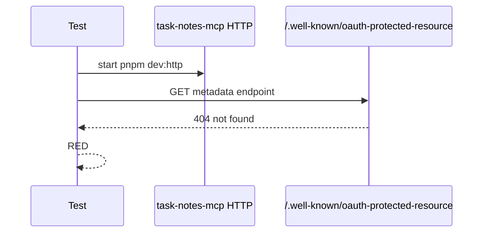
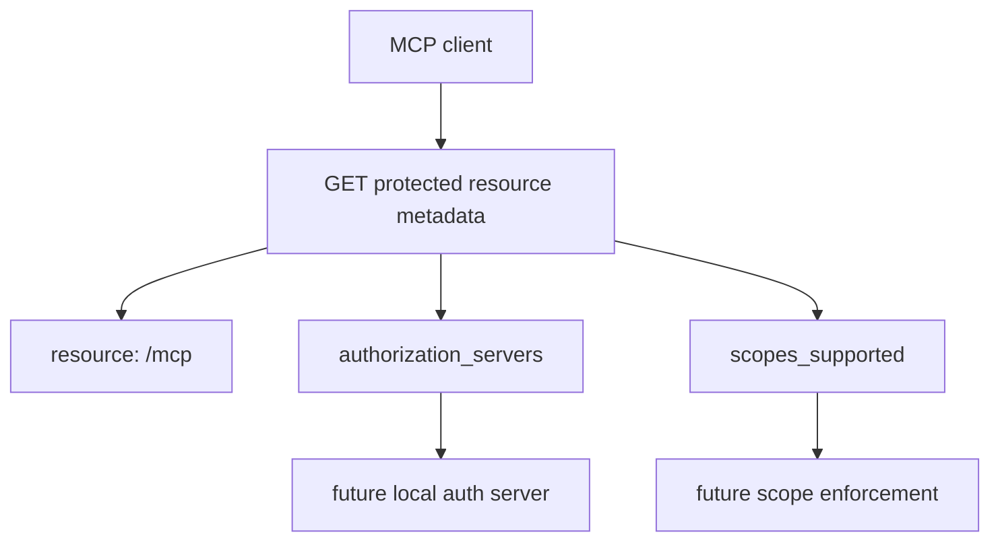

# Step 06: protected resource metadata を追加する

Step 06 では、HTTP MCP server に OAuth protected resource metadata endpoint を追加しました。

学習テーマは **MCP resource が必要な authorization server と scope を client に発見させること** です。

この step ではまだ bearer token 検証や scope enforcement は入れません。まず、HTTP MCP endpoint が「私はどの resource で、どの authorization server と scope を使うのか」を公開できるようにします。

## RED

最初に、HTTP endpoint を直接叩く結合テストを書きました。



RED の失敗は期待どおりでした。

- `rtk pnpm --filter task-notes-mcp test`
- 8 passed / 1 failed
- failure: `expected 404 to be 200`

この時点では metadata endpoint が未実装でした。

## GREEN

GREEN では `http.ts` に次の endpoint を追加しました。

```text
GET /.well-known/oauth-protected-resource
```

response は次の形です。

```json
{
  "resource": "http://127.0.0.1:<port>/mcp",
  "authorization_servers": ["http://127.0.0.1:4000"],
  "scopes_supported": ["task_notes:read", "task_notes:write"]
}
```



### `PUBLIC_URL`

`resource` は public client から見える `/mcp` URL です。

test では dynamic port を使うため、`PUBLIC_URL` を env で渡しています。手元では未指定なら `http://127.0.0.1:3000` 相当になります。

### `AUTH_ISSUER`

`authorization_servers` には後続 step で作る local auth server の issuer を入れます。

今は `http://127.0.0.1:4000` を default にしています。

## Verification

- `rtk pnpm --filter task-notes-mcp test`
  - passed: `Test Files 1 passed (1)`, `Tests 9 passed (9)`
- `rtk pnpm build`
  - passed: `task-notes-mcp`: `tsc -p tsconfig.json`

## Concept

protected resource metadata は、MCP client が authorization flow を始めるための発見情報です。

token なし request をどう拒否するか、JWT をどう検証するか、tool ごとの scope をどう強制するかは、この metadata が返せるようになってから積み上げます。

この順番にすると、transport failure、metadata discovery failure、authorization failure を別々に切り分けられます。
