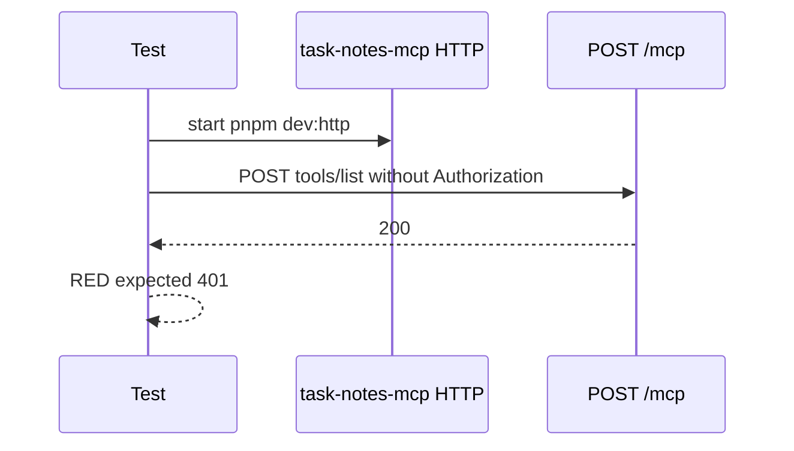
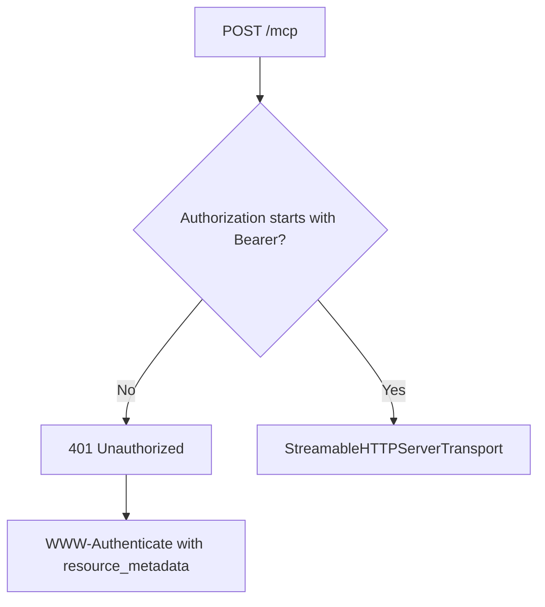

# Step 07: token なし HTTP MCP request を 401 にする

Step 07 では、token なしで `POST /mcp` された request を `401 Unauthorized` で拒否するようにしました。

学習テーマは **HTTP 認可境界と `WWW-Authenticate` header** です。

Step 06 で protected resource metadata を公開しました。Step 07 では、認証されていない client に対して、その metadata endpoint の場所を `WWW-Authenticate` header で伝えます。

## RED

最初に、raw HTTP request で `/mcp` を叩く結合テストを書きました。



RED の失敗は期待どおりでした。

- `rtk pnpm --filter task-notes-mcp test`
- 9 passed / 1 failed
- failure: `expected 200 to be 401`

この時点では token なしでも `/mcp` が Streamable HTTP transport に渡されていました。

## GREEN

GREEN では `/mcp` の入口で `Authorization: Bearer ...` が無い request を拒否するようにしました。



返す header:

```text
WWW-Authenticate: Bearer realm="mcp", resource_metadata="<PUBLIC_URL>/.well-known/oauth-protected-resource"
```

返す body:

```json
{
  "error": "unauthorized",
  "message": "A valid bearer token is required."
}
```

## Why not JWT validation yet?

この step では bearer token の中身はまだ検証しません。

理由は、JWT 検証には local auth server、issuer、audience、JWKS が必要で、ここで一緒に入れると失敗原因が混ざるからです。

今回は HTTP boundary だけを固定します。

- token が無い: `401`
- token がある: 次の処理へ進む

後続 step で local auth server と JWT validation を追加し、dummy bearer を実際の token 検証に置き換えます。

## Verification

- `rtk pnpm --filter task-notes-mcp test`
  - passed: `Test Files 1 passed (1)`, `Tests 10 passed (10)`
- `rtk pnpm build`
  - passed: `task-notes-mcp`: `tsc -p tsconfig.json`

## Concept

`401` は単なる拒否ではありません。

OAuth/OIDC 対応の MCP server では、client が次にどこを見れば authorization flow を始められるかを `WWW-Authenticate` header で示します。

Step 07 は、metadata discovery と token validation の間にある HTTP 認可境界を作る step です。
