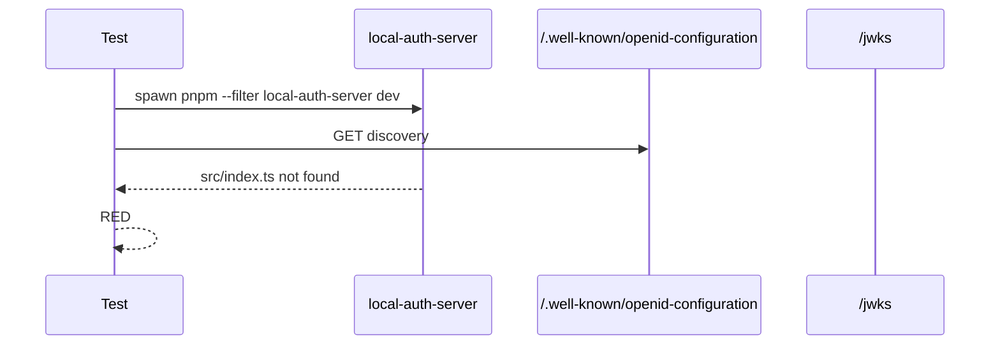
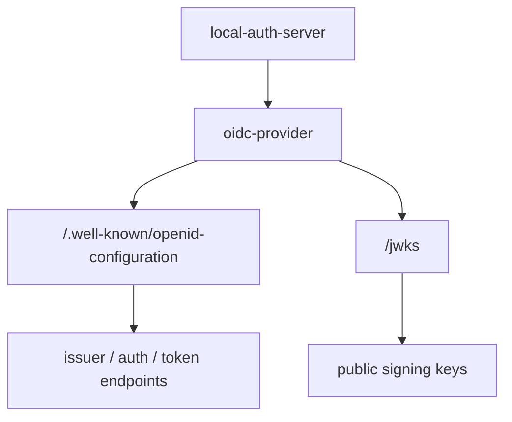

# Step 08: local auth server の discovery と JWKS を追加する

Step 08 では、dev 用の local authorization server を追加しました。

学習テーマは **OAuth/OIDC を自作せず、`oidc-provider` に任せること** です。

この step では login flow や token exchange までは実装対象にしません。まず MCP server が後続 step で参照できる authorization server として、OpenID Connect discovery と JWKS が返ることだけを確認します。

## RED

最初に `local-auth-server` の HTTP discovery を叩く結合テストを書きました。

RED の失敗は期待どおりでした。

- `rtk pnpm --filter local-auth-server test`
- failure: `ERR_MODULE_NOT_FOUND: apps/local-auth-server/src/index.ts`

package と test harness は作りましたが、server 実装がまだ無い状態でした。

## GREEN

GREEN では `oidc-provider` を使って最小の dev authorization server を追加しました。

### What we use from `oidc-provider`

`oidc-provider` に任せているもの:

- OpenID Provider discovery
- JWKS endpoint
- authorization endpoint
- token endpoint
- PKCE enforcement
- client metadata handling

この project で定義しているもの:

- dev client id
- redirect URIs
- supported scopes
- static dev account

## Verification

- `rtk pnpm --filter local-auth-server test`
  - passed: `Test Files 1 passed (1)`, `Tests 1 passed (1)`
- `rtk pnpm build`
  - passed: `task-notes-mcp` and `local-auth-server`

## Concept

OAuth/OIDC は自作しません。

この step の目的は、MCP server が次の JWT validation step で参照できる issuer と JWKS を用意することです。

local auth server が discovery と JWKS を返せるようになったので、次は MCP server 側で bearer token を JWT として検証できます。
