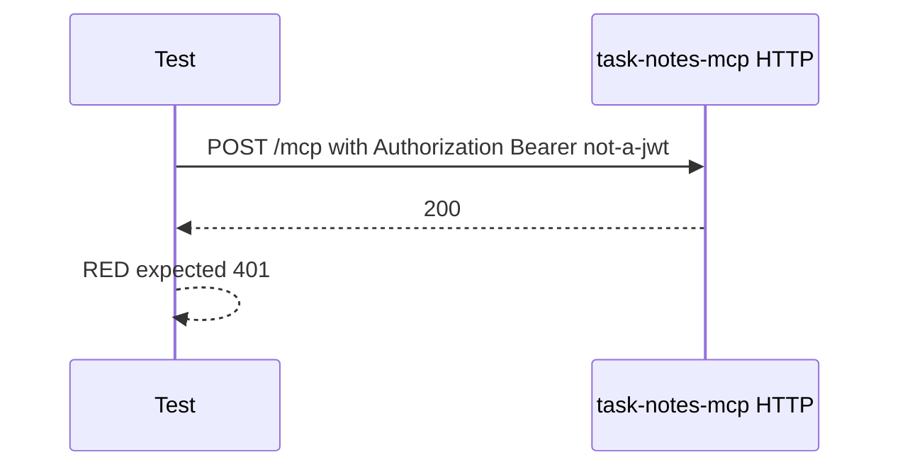
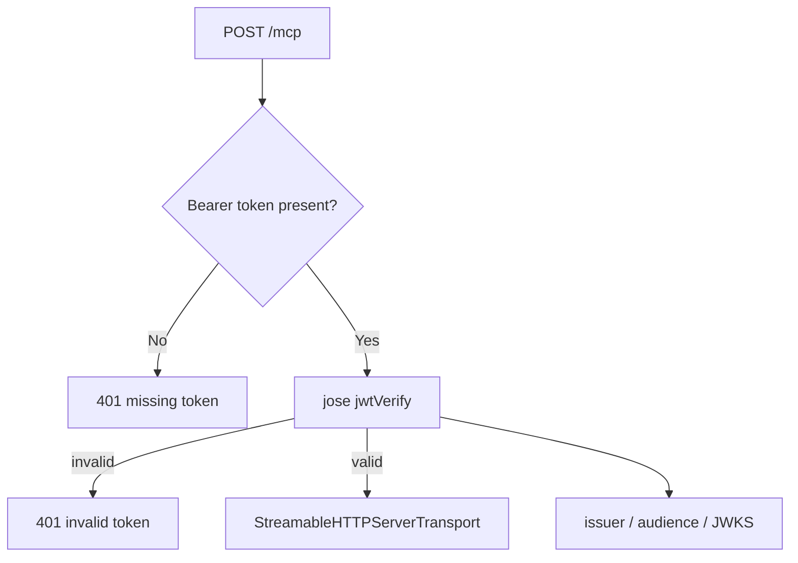

# Step 09: invalid bearer token を JWT validation で拒否する

Step 09 では、`Authorization: Bearer ...` が存在しても JWT として検証できない request を `401 Unauthorized` にする入口を追加しました。

学習テーマは **Bearer token の存在確認から JWT validation へ進むこと** です。

Step 07 では token が無い request を拒否しました。しかし token らしい文字列があるだけでは不十分です。MCP server は issuer、audience、JWKS を使って token を検証する必要があります。

## RED

最初に、invalid bearer token を送る HTTP 結合テストを書きました。

RED の失敗は期待どおりでした。

- `rtk pnpm --filter task-notes-mcp test`
- 10 passed / 1 failed
- failure: `expected 200 to be 401`

この時点では bearer token の有無だけを見ており、JWT としての検証はしていませんでした。

## GREEN

GREEN では `jose` を direct dependency に追加し、JWT verification module を作りました。

追加したもの:

- `apps/task-notes-mcp/src/auth.ts`
  - `verifyBearerToken(token, config)`
  - `createRemoteJWKSet`
  - `jwtVerify`
- `apps/task-notes-mcp/src/http.ts`
  - `AUTH_AUDIENCE`
  - `AUTH_JWKS_URL`
  - invalid token response
- `apps/task-notes-mcp/src/mcp-server.test.ts`
  - invalid bearer token rejection test

## Test boundary

既存の HTTP transport discovery test は、transport の動作確認に集中するため `AUTH_JWT_VALIDATION=disabled` で起動しています。

JWT validation の挙動は raw HTTP test で確認します。

この分離により、transport failure と auth failure を別々に見られます。

## Verification

- `rtk pnpm --filter task-notes-mcp test`
  - passed: `Test Files 1 passed (1)`, `Tests 11 passed (11)`
- `rtk pnpm build`
  - passed: `task-notes-mcp` and `local-auth-server`

## Concept

JWT validation は「Bearer token があるか」ではなく「信頼できる issuer が発行し、期待 audience に向けられ、JWKS で署名検証できるか」を確認する処理です。

今回の step では invalid token rejection までを固定しました。次の step で valid token を使った成功 path と scope enforcement に進めます。
