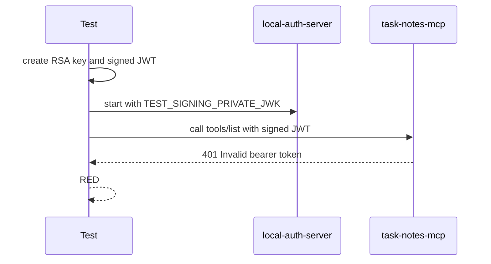
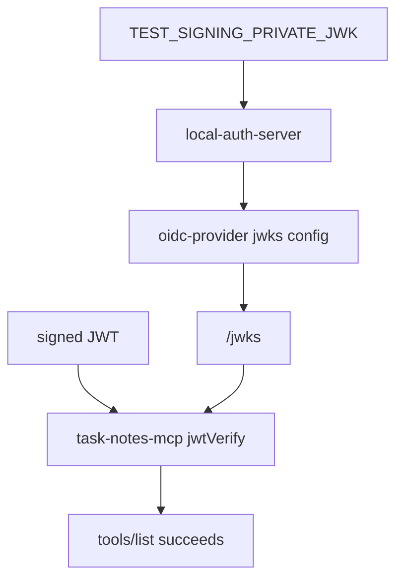

# Step 10: valid JWT で HTTP MCP tool discovery を通す

Step 10 では、local auth server の JWKS で検証できる JWT を使って、HTTP MCP の `tools/list` が通ることを確認しました。

学習テーマは **JWT validation の成功 path** です。

Step 09 では invalid bearer token を `401` にしました。今回は逆に、issuer、audience、JWKS が一致する token なら MCP transport に進めることを固定します。

## RED

最初に、test が署名した JWT を local auth server の JWKS で検証できる想定の結合テストを書きました。



RED の失敗は期待どおりでした。

- `rtk pnpm --filter task-notes-mcp test`
- 11 passed / 1 failed
- failure: `Invalid bearer token.`

この時点では、local auth server が test signing key を JWKS として公開していませんでした。

## Test readability refactor

RED 後に、テストが読みづらいことが分かったため、GREEN 実装前に helper を整理しました。

最終的な test body は次の流れだけを表します。

```ts
const trustedJwt = await createTrustedJwtFixture(["task_notes:read"]);

await withAuthServer(trustedJwt.issuer, trustedJwt.signingPrivateJwk, async () => {
  await withHttpMcpClientUsingBearer(trustedJwt.token, trustedJwt, async (client) => {
    const tools = await client.listTools();
    // assertions
  });
});
```

これは次の仕様を読ませるためです。

- trusted JWT を用意する
- auth server がその JWKS を公開する
- MCP server がその JWT を検証する
- MCP tool discovery が通る

## GREEN

GREEN では local auth server に test-only signing key injection を追加しました。



通常 dev 起動では `TEST_SIGNING_PRIVATE_JWK` は不要です。test のときだけ、JWT を署名した key と `/jwks` が公開する key を一致させます。

## Verification

- `rtk pnpm --filter task-notes-mcp test`
  - passed: `Test Files 1 passed (1)`, `Tests 12 passed (12)`
- `rtk pnpm --filter local-auth-server test`
  - passed: `Test Files 1 passed (1)`, `Tests 1 passed (1)`
- `rtk pnpm build`
  - passed: `task-notes-mcp` and `local-auth-server`

## Concept

JWT validation の成功条件は、token の形式だけではありません。

MCP server は次を確認します。

- token issuer が期待 issuer と一致する
- token audience が `task-notes-mcp` と一致する
- token signature が auth server の JWKS で検証できる

この step では valid JWT が transport まで進めることを確認しました。次は tool ごとの `task_notes:read` / `task_notes:write` scope enforcement に進みます。
