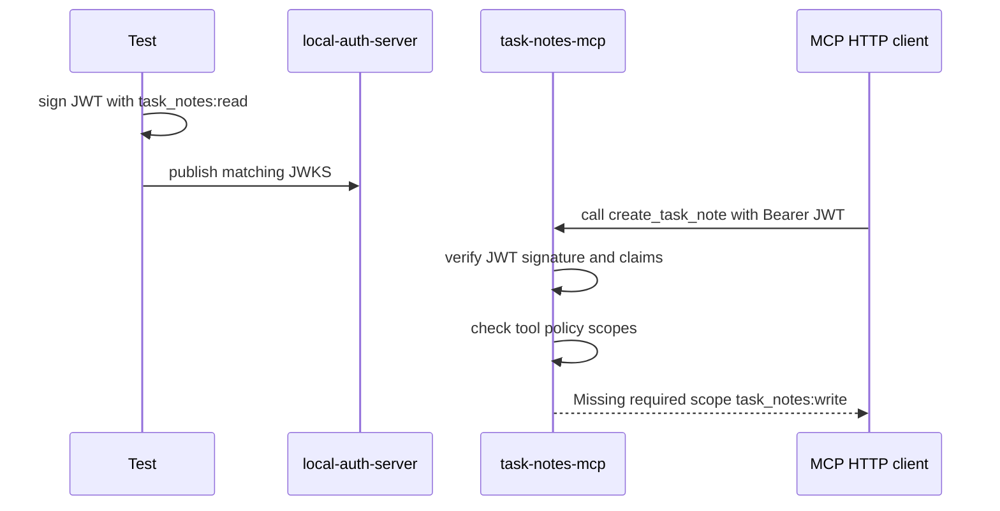
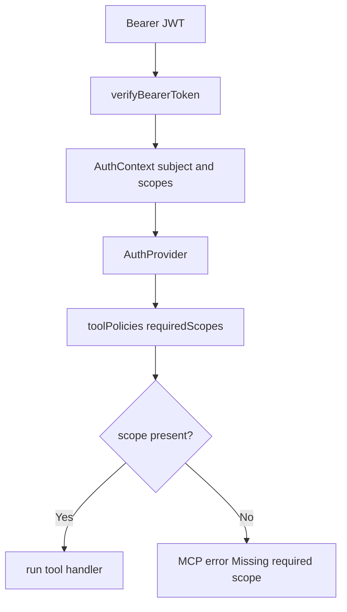

# Step 11: tool ごとの scope enforcement を追加する

Step 11 では、JWT として valid な token でも、tool が要求する scope を持っていなければ tool call を拒否するようにしました。

学習テーマは **authentication と authorization を分けること** です。

Step 10 では bearer JWT の署名、issuer、audience、JWKS が一致すれば HTTP MCP request を transport に通しました。しかし、それだけでは `task_notes:read` しか持たない token でも write tool を呼べてしまいます。

## RED

最初に、read scope だけを持つ trusted JWT で write tool を呼ぶ結合テストを追加しました。

このテストは private helper ではなく、実際に次の境界を通ります。

- local auth server の JWKS
- signed bearer JWT
- Streamable HTTP MCP transport
- MCP `callTool`
- `create_task_note` の tool policy

RED の結果:

- `rtk pnpm --filter task-notes-mcp test`
  - failed as expected: `Tests 12 passed`, `1 failed`
  - failure: `result.isError` が `undefined`

この失敗は、JWT validation の結果から scope を取り出しておらず、tool 実行時に `requiredScopes` を見ていなかったことを示しています。

## GREEN

GREEN では、JWT verification と tool authorization をつなぎました。

追加したもの:

- `auth.ts`
  - `verifyBearerToken` が `subject` と `scopes` を返す
  - `createRequestAuthProvider` が tool policy の `requiredScopes` を検査する
  - stdio / JWT validation disabled 用の `createDevelopmentAuthProvider` を用意する
- `mcp-server.ts`
  - `createTaskNotesMcpServer(repo, authProvider)` を受け取れるようにする
  - 各 tool handler の先頭で `authorize(auth, toolName)` を呼ぶ
- `http.ts`
  - JWT 検証後の `AuthContext` を request 専用の `AuthProvider` に変換する

## Verification

- `rtk pnpm --filter task-notes-mcp test`
  - passed: `Test Files 1 passed (1)`, `Tests 13 passed (13)`
- `rtk pnpm --filter local-auth-server test`
  - passed: `Test Files 1 passed (1)`, `Tests 1 passed (1)`
- `rtk pnpm build`
  - passed: `task-notes-mcp` and `local-auth-server`

## Why It Matters

JWT validation は「この token は信頼できる発行者から来たか」を確認します。

Scope enforcement は「この token はこの tool を実行してよいか」を確認します。

この 2 つを分けることで、MCP server は valid token を受け入れつつ、read-only client に write operation を許可しないようにできます。
