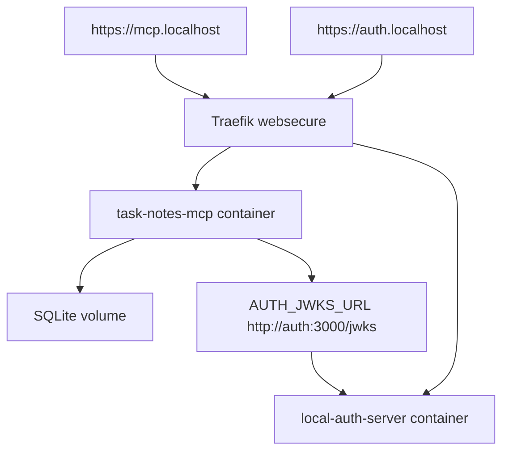

# Step 12: Traefik と Docker Compose で local HTTPS 境界を作る

Step 12 では、HTTP で動いていた `task-notes-mcp` と `local-auth-server` を Docker Compose 上に置き、Traefik で local HTTPS route を公開できる構成を追加しました。

この step は production code の振る舞い追加ではなく、runtime topology の構成です。そのため TDD ではなく、設定ファイルを追加して `docker compose config` と既存 build/tests で検証します。

## 追加したもの

- `docker-compose.yml`
  - `traefik`
  - `auth`
  - `mcp`
  - SQLite 永続化用 `task-notes-data` volume
- `infra/traefik/traefik.yml`
  - HTTPS entrypoint
  - Docker provider
  - file provider
- `infra/traefik/dynamic.yml`
  - mkcert で作る local certificate を Traefik に渡す
- `infra/certs/.gitignore`
  - generated certificate と private key を Git に入れない
- `apps/task-notes-mcp/Dockerfile`
- `apps/local-auth-server/Dockerfile`



## 重要な設計判断

`AUTH_ISSUER` と `AUTH_JWKS_URL` は分けています。

- `AUTH_ISSUER=https://auth.localhost`
  - token の issuer として外部 client が見る URL
- `AUTH_JWKS_URL=http://auth:3000/jwks`
  - MCP container が Docker network 内で JWKS を読む URL

issuer は token claim の検証対象なので `https://auth.localhost` のままにします。一方で、container 内から `auth.localhost` を読むと localhost 解決の問題が出やすいため、JWKS fetch は Docker DNS の service name を使います。

`task-notes-mcp` は container 内では `HOST=0.0.0.0` で listen します。local dev の default は `127.0.0.1` で十分ですが、container で loopback に bind すると Traefik から到達できません。

`local-auth-server` は Traefik の背後で動くため、`provider.proxy = true` を設定します。これにより OIDC discovery の endpoint URL が forwarded proto を反映し、`https://auth.localhost` として公開されます。

## Local Certificate

証明書は生成物なので commit しません。

```bash
rtk mkcert -cert-file infra/certs/local-cert.pem -key-file infra/certs/local-key.pem mcp.localhost auth.localhost localhost 127.0.0.1
```

## Verification

- `rtk docker compose config`
  - compose config parsed successfully
- `rtk pnpm --filter task-notes-mcp test`
  - expected to keep MCP contract tests green
- `rtk pnpm --filter local-auth-server test`
  - expected to keep OIDC discovery tests green
- `rtk pnpm build`
  - expected to keep TypeScript build green

## Why It Matters

remote MCP では local process の stdio とは違い、client から見える URL、issuer、TLS、service-to-service 通信の URL がずれます。

この step では OAuth/OIDC の中身を増やすのではなく、HTTPS と container topology の境界を先に分けて、次の Inspector / Codex client compatibility 確認に進める状態を作ります。
