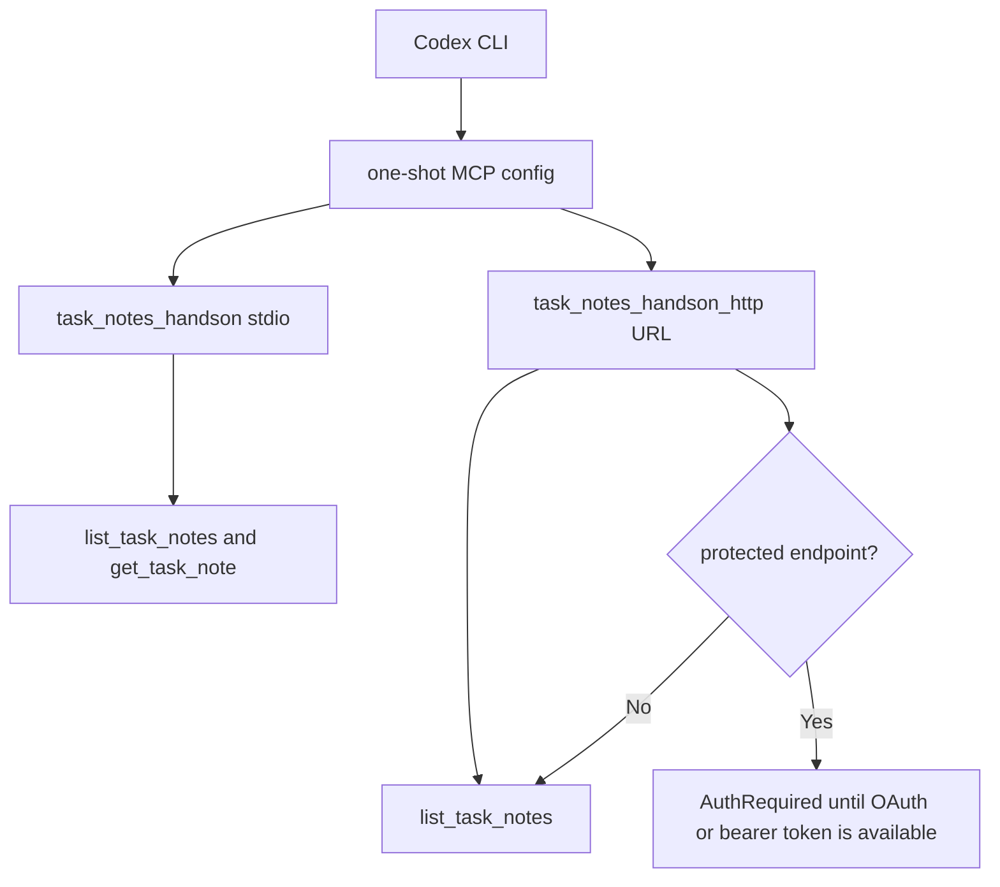

# Step 13: Codex client compatibility smoke を確認する

Step 13 では、実際の Codex CLI から MCP server を呼び出せるかを確認しました。

この step は production code の振る舞い追加ではありません。そのため TDD ではなく、real client smoke と docs 更新で進めます。

## 確認したこと

- global Codex MCP config にこの project server を追加していない
- stdio MCP server を one-shot config override で Codex から呼べる
- HTTP MCP server を one-shot URL override で Codex から呼べる
- protected HTTP MCP endpoint で `AuthRequired` が出る場合の切り分けを docs に残す



## Stdio Smoke

実行した command:

```bash
rtk env DATABASE_URL=file:/tmp/task-notes-handson-codex-stdio-smoke.db codex exec \
  --cd /Users/fukuyamaken/ghq/github.com/kenfdev/mcp-handson \
  --dangerously-bypass-approvals-and-sandbox \
  -c 'mcp_servers.task_notes_handson.command="pnpm"' \
  -c 'mcp_servers.task_notes_handson.args=["--dir","/Users/fukuyamaken/ghq/github.com/kenfdev/mcp-handson","--filter","task-notes-mcp","dev:stdio"]' \
  -c 'mcp_servers.task_notes_handson.env={DATABASE_URL="file:/tmp/task-notes-handson-codex-stdio-smoke.db"}' \
  -c 'mcp_servers.task_notes_handson.startup_timeout_sec=60' \
  'Use the task_notes_handson MCP server. List the task notes, then get task note id 1. Explain which MCP tools you used.'
```

観測結果:

```text
mcp: task_notes_handson/get_task_note started
mcp: task_notes_handson/list_task_notes started
mcp: task_notes_handson/get_task_note (completed)
mcp: task_notes_handson/list_task_notes (completed)
```

Codex は seed note を返し、使った tool として次を説明しました。

- `mcp__task_notes_handson.list_task_notes`
- `mcp__task_notes_handson.get_task_note`

## HTTP Smoke

project-local `.mcp.json` の HTTP endpoint は global config には登録せず、one-shot override で渡します。

```bash
MCP_URL=$(rtk node -e 'const fs = require("node:fs"); const config = JSON.parse(fs.readFileSync(".mcp.json", "utf8")); console.log(config.mcpServers.task_notes_handson_http.url);')

rtk codex exec \
  --cd /Users/fukuyamaken/ghq/github.com/kenfdev/mcp-handson \
  --dangerously-bypass-approvals-and-sandbox \
  -c "mcp_servers.task_notes_handson_http.url=\"$MCP_URL\"" \
  'Use the task_notes_handson_http MCP server. List available task note tools and then list task notes. Keep the answer concise.'
```

観測結果:

```text
mcp: task_notes_handson_http/list_task_notes started
mcp: task_notes_handson_http/list_task_notes (completed)
```

Codex は 4 つの task note tools と 2 件の seed notes を返しました。

## AuthRequired の意味

別ポートで fresh HTTP server を起動して URL-only Codex config から接続したとき、次の `AuthRequired` も観測しました。

```text
AuthRequired: Bearer realm="mcp", resource_metadata="http://127.0.0.1:<port>/.well-known/oauth-protected-resource"
```

これは transport failure ではありません。Codex が MCP endpoint に到達し、server が protected resource metadata を案内できている状態です。

protected HTTP MCP endpoint を tool call まで進めるには、client が OAuth flow を完了するか、server が受け入れる bearer token を渡す必要があります。Codex の URL-only one-shot config でそこまで進めない場合は、stdio smoke で tool compatibility を確認し、OAuth 付き HTTP flow は MCP Inspector などで確認します。

## Verification

- `rtk codex mcp list`
  - confirmed: `task_notes_handson` and `task_notes_handson_http` are not globally registered
- Codex CLI stdio smoke
  - passed: `list_task_notes` and `get_task_note` were called
- Codex CLI HTTP smoke
  - passed against the project HTTP endpoint listening on `127.0.0.1:3000`
- URL-only protected HTTP check
  - observed: `AuthRequired`, which confirms discovery/auth boundary behavior
