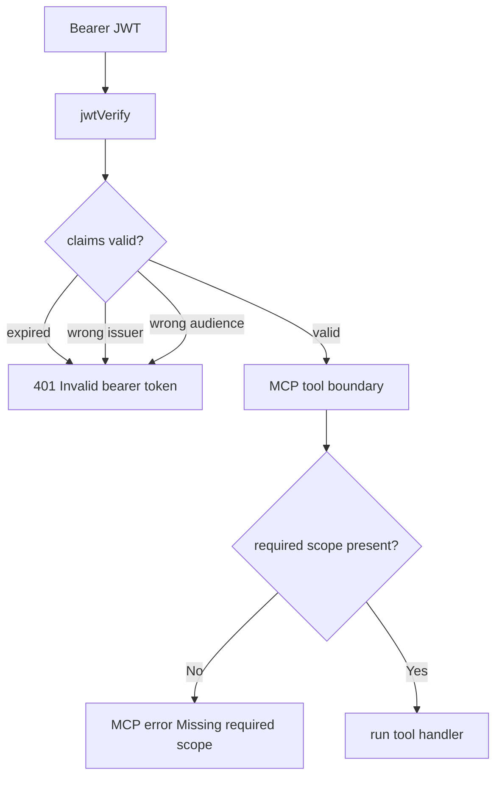

# Step 14: JWT auth hardening checks を追加する

Step 14 では、JWT validation と scope enforcement の重要な auth checklist を結合テストで固定しました。

この step は新しい production behavior を作る回ではありません。既に実装した `jose` の JWT verification と tool scope enforcement が、public HTTP MCP boundary で期待通り効いていることを確認する regression coverage です。

## 追加した checks

- expired bearer JWT は `/mcp` に入る前に `401` になる
- wrong issuer の bearer JWT は `/mcp` に入る前に `401` になる
- wrong audience の bearer JWT は `/mcp` に入る前に `401` になる
- `task_notes:write` scope を持つ valid JWT は write tool を実行できる

## なぜ raw HTTP test と MCP client test を分けたか

expired / wrong issuer / wrong audience は、MCP transport に渡す前に拒否されるべきです。そのため raw HTTP request で `401` と `WWW-Authenticate` を確認します。

write scope positive path は、transport に入った後の tool authorization と handler 実行まで見る必要があります。そのため official MCP SDK client で `create_task_note` を呼びます。

## Verification

- `rtk pnpm --filter task-notes-mcp test`
  - passed: `Test Files 1 passed (1)`, `Tests 17 passed (17)`

## Why It Matters

JWT validation は署名だけでは不十分です。

MCP server が remote endpoint として公開される場合、少なくとも次を同時に確認する必要があります。

- trusted issuer
- expected audience
- token lifetime
- tool-specific scope

この step で、invalid token rejection と valid write scope acceptance の両方を public boundary から確認できるようになりました。
