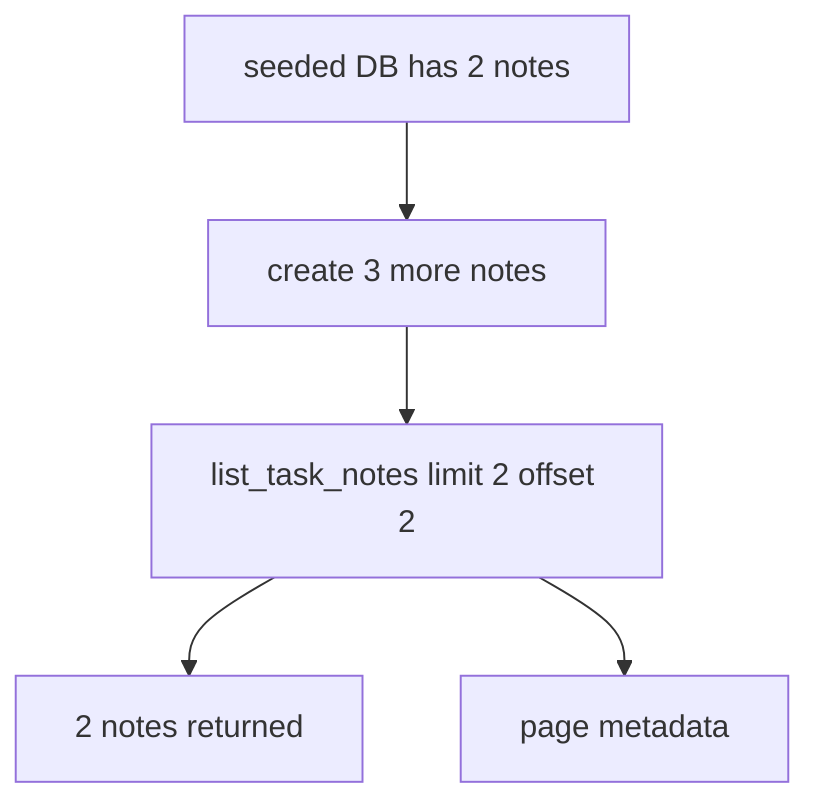
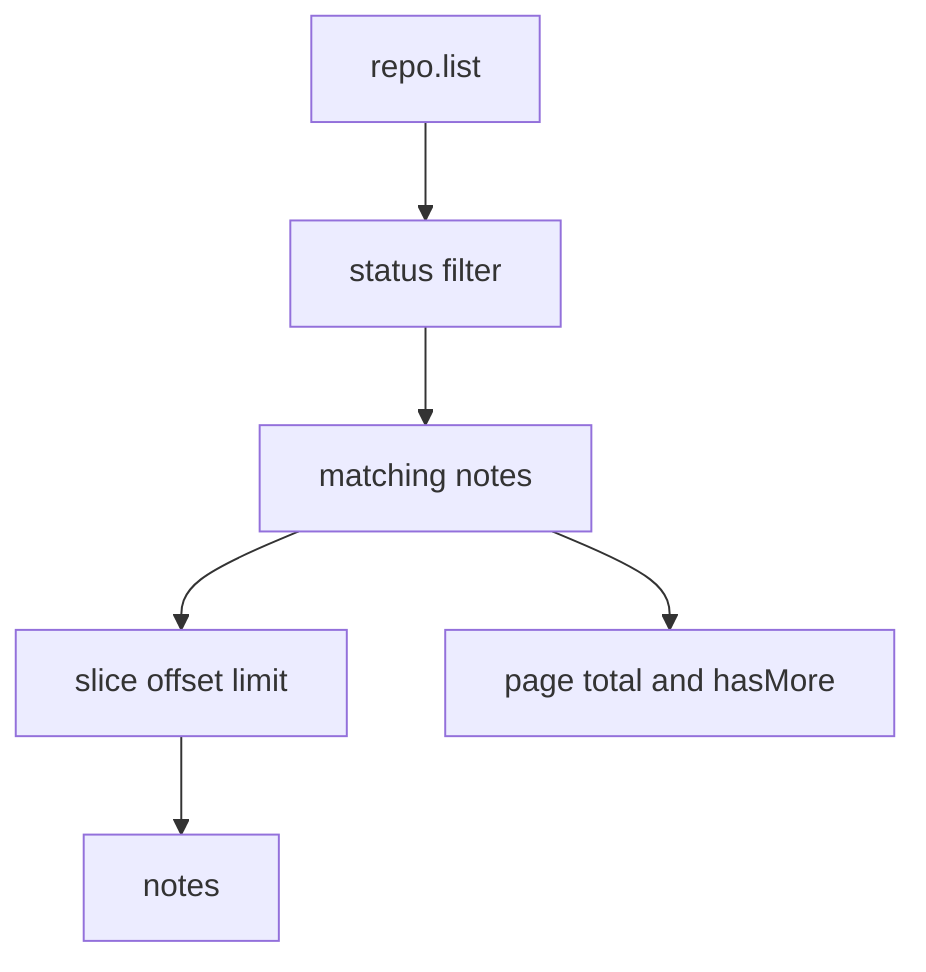

# Step 17: list_task_notes に pagination を追加する

Step 17 では、`list_task_notes` に `limit` と `offset` を追加し、tool output を bounded にしました。

学習テーマは **MCP tool output size を制御すること** です。

一覧 tool が全件を返し続けると、データが増えたときに response が大きくなりすぎます。remote MCP server では、client / agent / transport のどこで問題が出るか分かりにくくなるため、一覧系 tool は最初から pagination contract を持たせます。

## RED

最初に、public MCP interface から `limit` と `offset` を指定する結合テストを追加しました。

期待した response:

- `notes.length === 2`
- seed 2 件を skip して、追加した 1 件目と 2 件目が返る
- `page.limit === 2`
- `page.offset === 2`
- `page.total === 5`
- `page.hasMore === true`

RED の結果:

- `rtk pnpm --filter task-notes-mcp test`
  - failed as expected: `Tests 18 passed`, `1 failed`
  - failure: `list_task_notes` が `limit` / `offset` を解釈せず全 5 件を返した

## Test Readability Fix

最初の RED test は、test body では 3 件しか作っていないのに `total: 5` を期待しており、seed 2 件の前提が見えにくい状態でした。

そこで GREEN 実装前に次を直しました。

- `withMcpClient` を `withSeededMcpClient` に rename
- `SEEDED_TASK_NOTE_COUNT = 2` を追加
- `total` 期待値を `SEEDED_TASK_NOTE_COUNT + additionalNoteIndexes.length` に変更

これで、seed あり DB を使う前提が helper 名と期待値から読めるようになりました。

## GREEN

GREEN では `list_task_notes` の schema と handler を最小変更しました。

- `limit`
  - default: `50`
  - min: `1`
  - max: `100`
- `offset`
  - default: `0`
  - min: `0`
- response に `page` を追加

## Verification

- `rtk pnpm --filter task-notes-mcp test`
  - passed: `Test Files 1 passed (1)`, `Tests 19 passed (19)`

## Why It Matters

Pagination は UI のためだけではありません。

MCP tool output は agent context に入る可能性があるため、一覧 tool が無制限に data を返すと、latency、token usage、client rendering、agent reasoning のすべてに影響します。

この step で、`list_task_notes` は bounded output と pagination metadata を持つ tool contract になりました。
