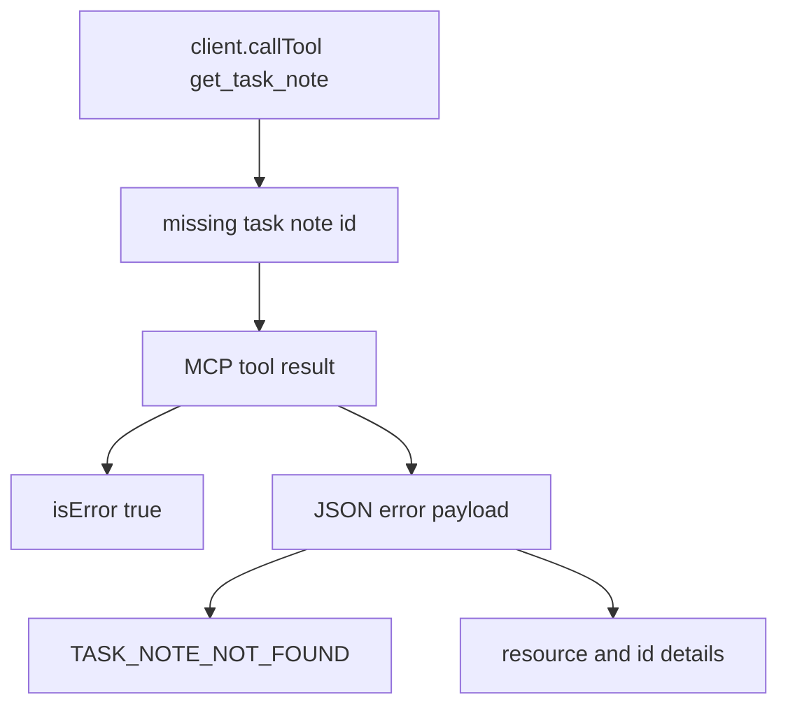
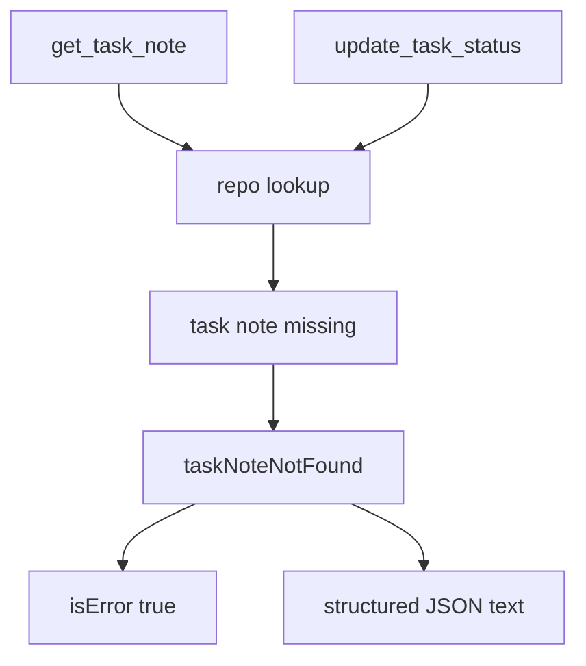

# Step 18: MCP tool error を構造化する

Step 18 では、`get_task_note` の not-found error をプレーンテキストから machine-readable JSON に変えました。

学習テーマは **LLM / client が判断しやすい tool error contract を作ること** です。

MCP tool は失敗時にも `content` を返します。ここが単なる文字列だけだと、人間には読めても client や agent が原因を安定して分類しにくくなります。そこで domain error code と details を含む JSON にしました。

## RED

最初に、public MCP interface から存在しない task note を取得する結合テストを追加しました。



期待した response:

- `isError === true`
- `content[0].type === "text"`
- `content[0].text` が JSON として parse できる
- `error.code === "TASK_NOTE_NOT_FOUND"`
- `error.details.resource === "task_note"`
- `error.details.id === 9999`

RED の結果:

- `rtk pnpm --filter task-notes-mcp test`
  - failed as expected: `Tests 18 passed`, `1 failed`
  - failure: existing implementation returned plain text: `Task note 9999 was not found.`

## GREEN

GREEN では not-found response を生成する helper を `taskNoteNotFound(id)` にしました。

返す形:

```json
{
  "error": {
    "code": "TASK_NOTE_NOT_FOUND",
    "message": "Task note 9999 was not found.",
    "details": {
      "resource": "task_note",
      "id": 9999
    }
  }
}
```

`get_task_note` と `update_task_status` はどちらも task note id を扱うため、同じ helper を使います。これにより、tool ごとに微妙に違う not-found format が増えるのを避けます。



## Verification

- `rtk pnpm --filter task-notes-mcp test`
  - passed: `Test Files 1 passed (1)`, `Tests 19 passed (19)`

## Why It Matters

MCP server が agent に渡す error は、単なるログではなく protocol boundary の一部です。

構造化された error code があると、client / agent / future UI は次のような判断をしやすくなります。

- user に「その note は存在しない」と説明する
- retry すべき transient error ではないと判断する
- `details.id` を使って、どの入力が問題だったかを特定する

この step で、task note の domain error は人間にも agent にも読みやすい contract になりました。
