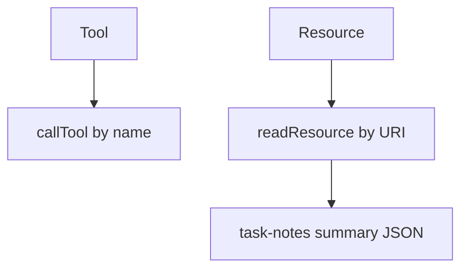
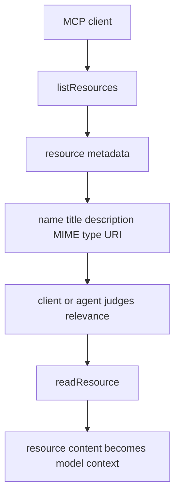
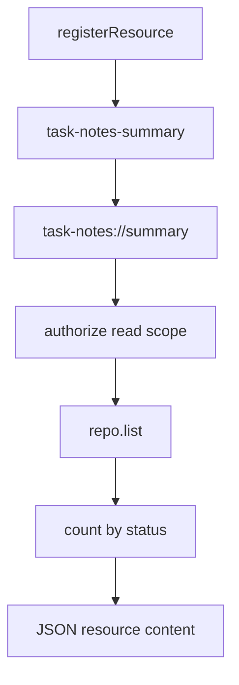

# Step 19: task notes summary resource を追加する

Step 19 では、`task-notes://summary` という MCP Resource を追加しました。

学習テーマは **tool と resource の役割分担** です。

これまで作ってきた `list_task_notes` や `create_task_note` は Tool です。Tool は action を表します。一方、Resource は LLM / client に渡せる read-only context を URI で公開します。

## Resource の URI とは何か

MCP Resource は URI で識別されます。

今回の URI:

```text
task-notes://summary
```

これは HTTP endpoint ではありません。MCP server が定義する logical URI です。

Tool が `name` で呼ばれるのに対して、Resource は `uri` で読まれます。



## Resource は自動発火するのか

Resource は server 側で勝手に LLM に注入されるものではありません。

基本の流れは次です。



つまり、server ができるのは resource を公開することです。いつ読むかは MCP client / host / agent workflow の判断です。

その判断材料になるのが metadata です。

- `name`
- `title`
- `description`
- `mimeType`
- `uri`

今回の description は、単に「summaryです」ではなく、いつ使うべきかまで書いています。

```text
Read-only current task note counts grouped by status. Use this when answering questions about overall task progress or workload.
```

このように書くことで、ユーザーが「今のタスク状況を教えて」と聞いたときに、client / agent がこの resource を読むべきだと判断しやすくなります。

## RED

最初に、public MCP interface だけを使う結合テストを追加しました。

- `client.listResources()` で `task-notes://summary` を発見できる
- metadata に `title`、`description`、`mimeType` が含まれる
- `client.readResource({ uri: "task-notes://summary" })` で JSON を読める
- seed 済み DB の概要として `total: 2`、`open: 2`、`done: 0`、`archived: 0` が返る

RED の結果:

- `rtk pnpm --filter task-notes-mcp test`
  - failed as expected: `Tests 19 passed`, `1 failed`
  - failure: `MCP error -32601: Method not found`

この失敗は、server が resources capability をまだ提供していなかったことを示しています。

## GREEN

GREEN では `server.registerResource` を追加しました。



Resource は read-only context ですが、誰でも読めてよいわけではありません。HTTP transport でも task note 状態を守るため、`list_task_notes` と同じ read scope を要求します。

実装途中で、SDK の実際の返却形も確認しました。

- `name` は registration name: `task-notes-summary`
- `title` は display title: `Task Notes Summary`

そのためテストも、実際の MCP contract に合わせて `name` と `title` を分けて確認しています。

## Verification

- `rtk pnpm --filter task-notes-mcp test`
  - passed: `Test Files 1 passed (1)`, `Tests 20 passed (20)`

## Why It Matters

Tool だけで状態を読む設計にすると、LLM は毎回 action として tool call を選ぶ必要があります。

Resource を用意すると、server は「この情報は読み取り専用の文脈として使える」と client に伝えられます。

今回の step で、Task Notes MCP server は action だけでなく、LLM に渡せる read-only context も公開できるようになりました。
