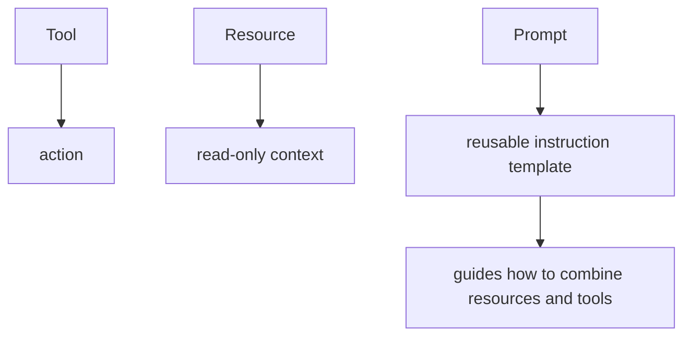
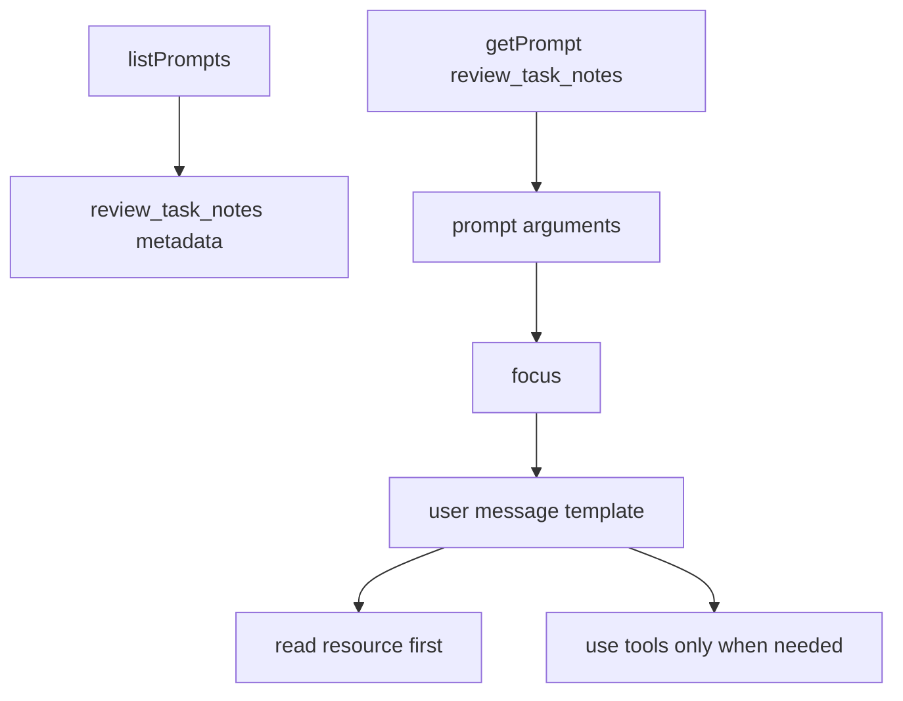

# Step 20: task review prompt を追加する

Step 20 では、`review_task_notes` という MCP Prompt を追加しました。

学習テーマは **Prompt は tool / resource の使い方を client と LLM に渡す reusable template である** という点です。

Step 19 で `task-notes://summary` Resource を追加しました。今回の Prompt は、その Resource をいつ読むべきか、足りないときにどの Tool を使うべきかを案内します。

## Tool / Resource / Prompt の違い



Prompt は server 側で Tool を直接呼ぶものではありません。Prompt は会話メッセージのテンプレートを返します。そのメッセージを読んだ client / LLM が、必要に応じて Resource や Tool を使います。

今回の Prompt は次を案内します。

- まず `task-notes://summary` を読む
- summary だけでは足りない場合に `list_task_notes` を使う
- 特定の note を詳しく見る必要がある場合に `get_task_note` を使う
- user が明示しない限り create / update はしない

## RED

最初に、public MCP interface だけを使う結合テストを追加しました。

- `client.listPrompts()` で `review_task_notes` を発見できる
- metadata に `title` と `description` が含まれる
- `client.getPrompt()` で prompt messages を取得できる
- prompt text が `task-notes://summary` と `list_task_notes` の使い分けを案内する
- `focus` argument が prompt text に反映される

RED の結果:

- `rtk pnpm --filter task-notes-mcp test`
  - failed as expected: `Tests 20 passed`, `1 failed`
  - failure: `MCP error -32601: Method not found`

この失敗は、server が prompts capability をまだ提供していなかったことを示しています。

## GREEN

GREEN では `server.registerPrompt` を追加しました。



実装途中で、SDK の `registerPrompt` について重要な差分を確認しました。

この project で使っている `@modelcontextprotocol/sdk` では、Prompt の `argsSchema` は `z.object(...)` ではなく shape object を渡す必要があります。

```ts
argsSchema: {
  focus: z.string().optional()
}
```

`z.object({ focus: ... })` を渡すと、実行時に次の error になりました。

```text
MCP error -32603: keyValidator._parse is not a function
```

Tool の `inputSchema` とは形が違うため、Prompt を実装するときはローカル SDK の実例と型に合わせる必要があります。

## Verification

- `rtk pnpm --filter task-notes-mcp test`
  - passed: `Test Files 1 passed (1)`, `Tests 21 passed (21)`

## Why It Matters

Tool と Resource を追加しても、client / LLM がそれらをどう組み合わせるべきかは自明ではありません。

Prompt を公開すると、server は domain-specific な作業手順を reusable template として渡せます。

この step で、Task Notes MCP server は次の三本柱を持ちました。

- Tool: action
- Resource: read-only context
- Prompt: reusable workflow guidance
