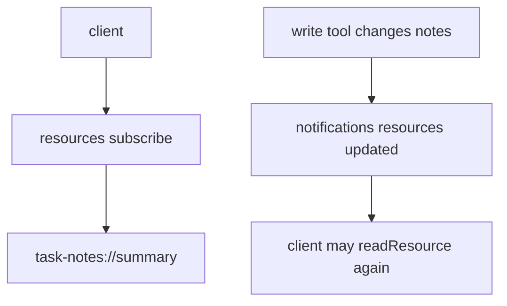
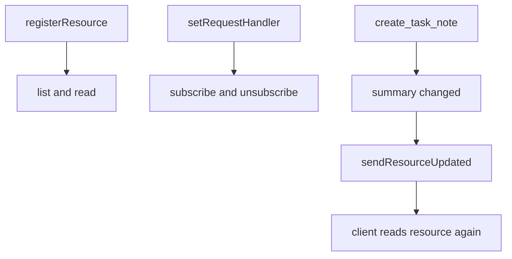

# Step 21: resource update notification を追加する

Step 21 では、`task-notes://summary` Resource の更新通知を追加しました。

学習テーマは **Resource subscription は content push ではなく、client に readResource のきっかけを渡す仕組み** です。

Step 19 で summary Resource を追加し、Step 20 で Prompt からその Resource を先に読むよう案内しました。今回は、summary が変わったことを client に通知できるようにします。

## Subscribe と Updated Notification

MCP client は特定の Resource URI に subscribe できます。



重要なのは、updated notification は Resource の中身そのものを送るものではない点です。

通知が伝えるのは、基本的にこれだけです。

```json
{
  "uri": "task-notes://summary"
}
```

client はこの通知を受け取ったら、必要に応じて `readResource({ uri })` で最新の内容を読み直します。

## RED

最初に、public MCP interface だけを使う結合テストを追加しました。

- `client.subscribeResource({ uri: "task-notes://summary" })` で購読する
- `create_task_note` で task note を増やす
- `notifications/resources/updated` を受け取る
- 通知の `params.uri` が `task-notes://summary`
- 通知後に `readResource` すると summary count が増えている

RED の結果:

- `rtk pnpm --filter task-notes-mcp test`
  - failed as expected: `Tests 21 passed`, `1 failed`
  - failure: `MCP error -32601: Method not found`

この失敗は、server が `resources/subscribe` request handler をまだ持っていなかったことを示しています。

## GREEN

GREEN では、低レベルの `server.server` API を使いました。

高水準 `McpServer.registerResource` は `resources/list` と `resources/read` を提供します。一方、この SDK version では `resources/subscribe` と `resources/unsubscribe` は自分で request handler を登録する必要があります。



実装では次を行いました。

- `resources.subscribe` capability を宣言
- `SubscribeRequestSchema` の handler を追加
- `UnsubscribeRequestSchema` の handler を追加
- subscribe 時に `task_notes:read` scope を要求
- `create_task_note` と `update_task_status` の成功時に `sendResourceUpdated`

unknown URI は購読対象にせず、`InvalidParams` にしています。

## Verification

- `rtk pnpm --filter task-notes-mcp test`
  - passed: `Test Files 1 passed (1)`, `Tests 22 passed (22)`

## Why It Matters

Resource は読み取り専用 context ですが、context は時間とともに古くなります。

subscription を用意すると、client は polling だけに頼らず、server から「この Resource は変わった」という signal を受け取れます。

この step で、Task Notes MCP server は Resource を公開するだけでなく、Resource が変わったことも client に伝えられるようになりました。
