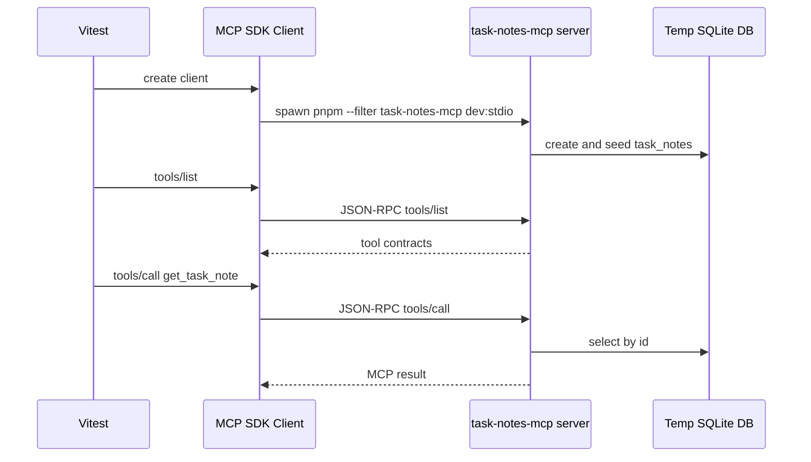

# Testing the Task Notes MCP server

## 1. Automated integration test

The most useful automated test at this stage is an MCP contract test.

It starts the real stdio MCP server as a child process, connects with the official MCP SDK client, then calls MCP protocol methods.



Run it:

```bash
pnpm --filter task-notes-mcp test
```

The test covers:

- `tools/list` exposes `list_task_notes`, `get_task_note`, `create_task_note`, and `update_task_status`
- `get_task_note` exposes read-only annotations and `_meta.policy`
- `list_task_notes` returns seeded notes
- `get_task_note { id: 1 }` succeeds
- `get_task_note { id: 9999 }` returns domain not-found
- `get_task_note { id: -1 }` returns MCP input validation error
- `create_task_note` creates durable data that can be read back
- `update_task_status` updates durable data that can be read back
- Streamable HTTP exposes the same tool contracts through `/mcp`

This is not a unit test. It uses the actual MCP transports and actual SQLite storage.

## 2. Real LLM client test

The repository includes a project-local `.mcp.json`:

```json
{
  "mcpServers": {
    "task_notes_handson": {
      "command": "pnpm",
      "args": ["--filter", "task-notes-mcp", "dev:stdio"],
      "env": {
        "DATABASE_URL": "file:./task-notes.mcp.db"
      }
    },
    "task_notes_handson_http": {
      "url": "http://127.0.0.1:3000/mcp"
    }
  }
}
```

Use this project-local config instead of adding the server to `~/.codex/config.toml`.

Confirm the global Codex config does not contain this server:

```bash
codex mcp list
```

If your LLM client supports project `.mcp.json`, open or run it from the repository root and ask it to use `task_notes_handson`.

Example prompt:

```text
Use the task_notes_handson MCP server. List the task notes, then get task note id 1. Explain which MCP tools you used.
```

Current Codex CLI note:

As of the Codex CLI used in this session, `codex exec --cd <repo>` did not auto-load `.mcp.json`. To test with Codex without writing to `~/.codex/config.toml`, pass the MCP server as one-shot config overrides:

```bash
codex exec \
  --cd /Users/fukuyamaken/ghq/github.com/kenfdev/mcp-handson \
  --dangerously-bypass-approvals-and-sandbox \
  -c 'mcp_servers.task_notes_handson.command="pnpm"' \
  -c 'mcp_servers.task_notes_handson.args=["--dir","/Users/fukuyamaken/ghq/github.com/kenfdev/mcp-handson","--filter","task-notes-mcp","dev:stdio"]' \
  -c 'mcp_servers.task_notes_handson.env={DATABASE_URL="file:/tmp/task-notes-handson-codex-oneshot.db"}' \
  -c 'mcp_servers.task_notes_handson.startup_timeout_sec=60' \
  'Use the task_notes_handson MCP server. List the task notes, then get task note id 1. Explain which MCP tools you used.'
```

What to look for:

- Codex should discover the `task_notes_handson` server.
- The model should call `list_task_notes`.
- The model should call `get_task_note` with `id: 1`.
- The answer should mention the returned seed notes.

This validates client compatibility at the LLM-agent layer. It is slower and less deterministic than the Vitest integration test, so use it as a smoke test rather than the primary regression suite.

Observed result in this session with Codex CLI 0.136.0:

```text
mcp: task_notes_handson/get_task_note started
mcp: task_notes_handson/list_task_notes started
mcp: task_notes_handson/get_task_note (completed)
mcp: task_notes_handson/list_task_notes (completed)
```

Codex answered with the seeded notes and explicitly said it used:

- `mcp__task_notes_handson.list_task_notes`
- `mcp__task_notes_handson.get_task_note` with `{ "id": 1 }`

## 3. Codex CLI with the HTTP MCP server

Codex CLI 0.136.0 supports Streamable HTTP MCP servers through `mcp_servers.<name>.url`, but it does not automatically load this repository's `.mcp.json` during `codex exec`.

Do not run `codex mcp add --url` for this project unless you intentionally want a global registration. For project-local testing, start the HTTP server and pass a one-shot override.

Terminal 1:

```bash
rtk env DATABASE_URL=file:./task-notes.http.db HOST=127.0.0.1 PORT=3000 pnpm --filter task-notes-mcp dev:http
```

Terminal 2:

```bash
MCP_URL=$(rtk node -e 'const fs = require("node:fs"); const config = JSON.parse(fs.readFileSync(".mcp.json", "utf8")); console.log(config.mcpServers.task_notes_handson_http.url);')

rtk codex exec \
  --cd /Users/fukuyamaken/ghq/github.com/kenfdev/mcp-handson \
  --dangerously-bypass-approvals-and-sandbox \
  -c "mcp_servers.task_notes_handson_http.url=\"$MCP_URL\"" \
  'Use the task_notes_handson_http MCP server. List available task note tools and then list task notes. Keep the answer concise.'
```

Expected observation:

```text
mcp: task_notes_handson_http/list_task_notes started
mcp: task_notes_handson_http/list_task_notes (completed)
```

The answer should list these tools:

- `list_task_notes`
- `create_task_note`
- `get_task_note`
- `update_task_status`

Observed result in this session with Codex CLI 0.136.0 and a project HTTP server already listening on `127.0.0.1:3000`:

```text
mcp: task_notes_handson_http/list_task_notes started
mcp: task_notes_handson_http/list_task_notes (completed)
```

Codex answered with the four task note tools and the two seeded task notes.

If Codex reports `AuthRequired` for the HTTP server, the client reached the MCP endpoint but did not complete authorization. That is expected for a protected HTTP MCP endpoint unless the client can perform the OAuth flow or provide an accepted bearer token. In that case:

- use the stdio smoke test for basic Codex tool compatibility
- use MCP Inspector or another OAuth-capable client for the protected HTTP flow
- confirm `/.well-known/oauth-protected-resource` and the auth server discovery endpoints first
