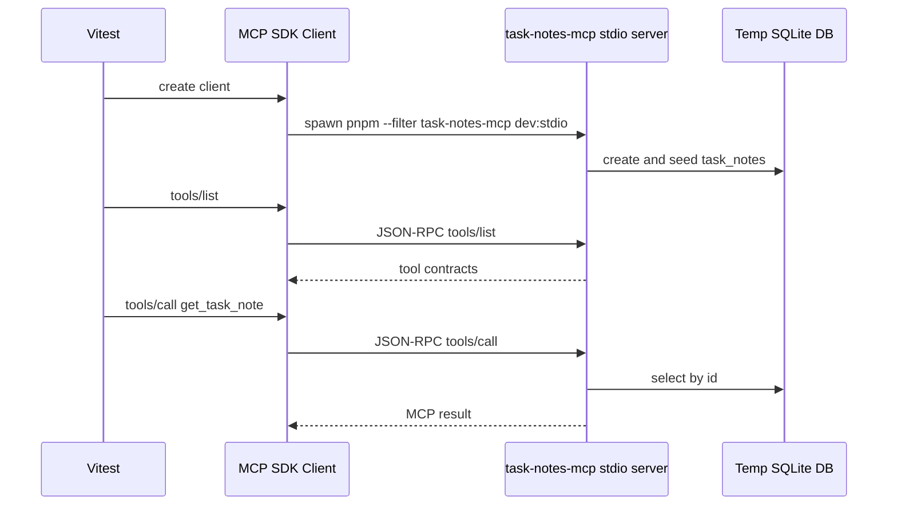

# Testing the Task Notes MCP server

## 1. Automated integration test

The most useful automated test at this stage is an MCP contract test.

It starts the real stdio MCP server as a child process, connects with the official MCP SDK client, then calls MCP protocol methods.



Run it:

```bash
pnpm --filter task-notes-mcp test
```

The test covers:

- `tools/list` exposes `list_task_notes` and `get_task_note`
- `get_task_note` exposes read-only annotations and `_meta.policy`
- `list_task_notes` returns seeded notes
- `get_task_note { id: 1 }` succeeds
- `get_task_note { id: 9999 }` returns domain not-found
- `get_task_note { id: -1 }` returns MCP input validation error

This is not a unit test. It uses the actual stdio transport and actual SQLite storage.

## 2. Real Codex client test

You can also register this server with Codex and ask the LLM to use it.

Register the stdio MCP server:

```bash
codex mcp add task-notes-handson \
  --env DATABASE_URL=file:/tmp/task-notes-handson-codex.db \
  -- pnpm --dir /Users/fukuyamaken/ghq/github.com/kenfdev/mcp-handson \
  --filter task-notes-mcp dev:stdio
```

Confirm Codex sees it:

```bash
codex mcp list
codex mcp get task-notes-handson
```

Then run a real LLM prompt:

```bash
codex exec \
  --cd /Users/fukuyamaken/ghq/github.com/kenfdev/mcp-handson \
  'Use the task-notes-handson MCP server. List the task notes, then get task note id 1. Explain which MCP tools you used.'
```

What to look for:

- Codex should discover the `task-notes-handson` server.
- The model should call `list_task_notes`.
- The model should call `get_task_note` with `id: 1`.
- The answer should mention the returned seed notes.

This validates client compatibility at the LLM-agent layer. It is slower and less deterministic than the Vitest integration test, so use it as a smoke test rather than the primary regression suite.

Observed result in this session:

```text
mcp: task-notes-handson/get_task_note started
mcp: task-notes-handson/list_task_notes started
mcp: task-notes-handson/list_task_notes (completed)
mcp: task-notes-handson/get_task_note (completed)
```

Codex answered with the seeded notes and explicitly said it used `list_task_notes` and `get_task_note`.

Remove the server when you no longer need it:

```bash
codex mcp remove task-notes-handson
```
